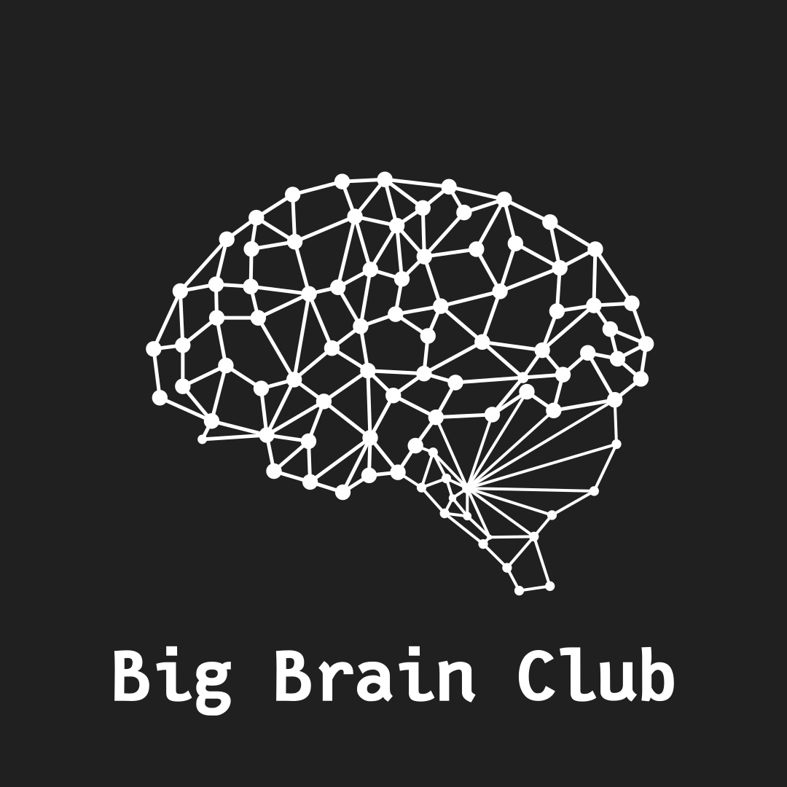
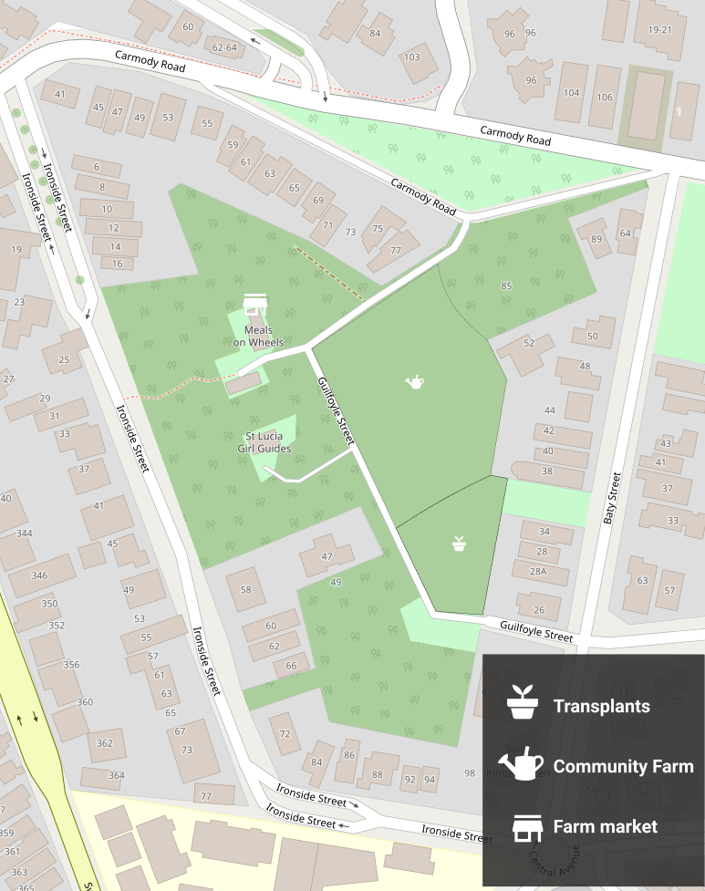
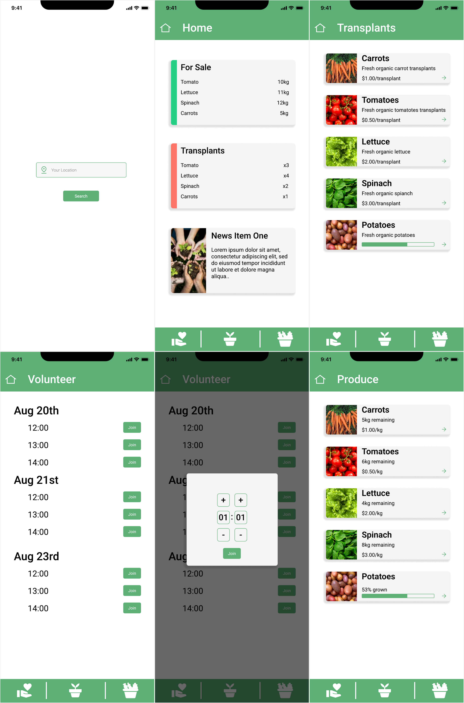

# GovHack 2022
* **Team: The Big Brain Club**
* **Project: Microfarming at scale**

Exploring the feasibility of creating a microfarming economy. Whether through community-based farms or privately owned farms, is there room to take the strain off the food supply in our increasingly growing population. Further, the option to reduce the reliance on imports for food will increase self-sufficiency for Australia. Transport emissions both international and domestic would be reduced due to the proximity of local farms and the centralised distribution centres.

## How They Work
* Farm location is decided based on government open datasets pertaining to [parks locations](https://www.data.qld.gov.au/dataset/built-features-queensland-series/resource/8cc4416e-0f0a-445b-9e90-9a1318366fa2) and [administrative zones](https://www.data.qld.gov.au/dataset/local-government-area-boundaries-queensland). 
* They are operated by community volunteers and they will form bodies to manage the farm, this includes quality controls, production, and other such regulations.
* The community farms will all internally have a section of land reserved for growing transplants. This operation is run the by councils.
* The farms will have a farm market to sell produce and transplants at a cheaper price to the community.
* In addition to this, the farms will also offer subsidies in the form of cheap or even free food to lower income members of the community, making it an open and inclusive environment.

### Internal Organisation of a Farm

## App
As part of the solution we're including an app that can be used by members of the community to interact with their community farms, they can use the app to 
  * Check for availability of grown produce and transplants.
  * Find opertutnities to volunteer at the farm (minimum of 1 hour)
  * Have access to a daily overview of the farm, this includes information like
    * Stock availability of produce and transplants
    * News and updates on the farm an how its engaging with the community.

## Raw Data Analysis
* [Consumer Price Index (CPI) and wages](Data_Analytics/Data.ipynb)
* [Parks and LGAs](Data_Analytics/ParksToLGA.ipynb)